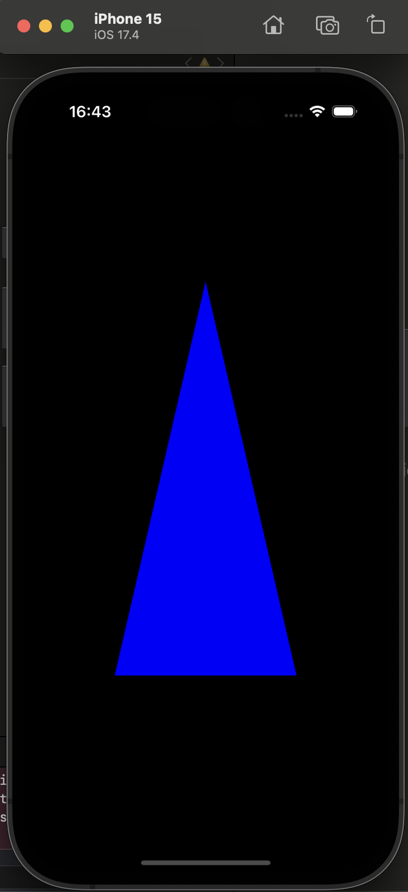
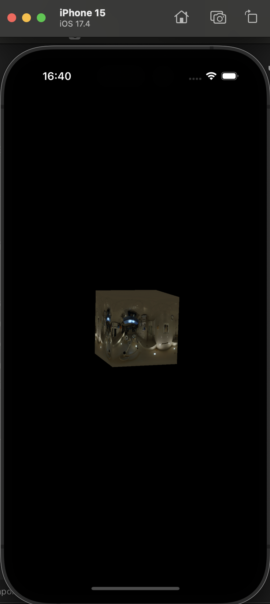

# swift-metal-renderer

## Table of Contents

+ [Summary](#summary)
+ [Features](#features)
+ [Getting started](#getting-started)
+ [Results](#results)

## Summary

iOS and macOS based Swift Metal API renderer

## Features

- [ ] Compilation on iOS
- [ ] Compilation on macOS
- [ ] Support for USD and/or glTF scene loading
- [ ] PBR shader pipeline considering primarily the metal roughness workflow
- [ ] Integrated simple menu (e.g. with buttons, sliders and other widgets)
- [ ] High code coverage
- [ ] CI workflows ensuring continuous testing of the modules 
- [ ] Integrated simple menu (e.g. with sliders and other widgets)
- [ ] Skeletal animation support (**OPTIONAL**)
- [ ] Native file dialog support for loading new glTF or USD scenes

## Getting started

### Preconditions

- MacOS device with XCode version >=15.3
- Use the iPhone simulator in Xcode, or optionally a real device. Tested on an iOS 17.4 device

### Steps

Launch one of the [sample applications](./apps/) in Xcode. 
You can choose to use either the iPhone simulator in Xcode or an iOS device running version 17.4 or higher. If opting for a real device, connect it to your macOS device. Then build and run the applications on the specified iOS device or iPhone simulator.

## Results

Results for the [Triangle application](./apps/Triangle/) should resemble:

Results for the [RotatingTexturedCube application](./apps/RotatingTexturedCube/) should resemble:

TBD